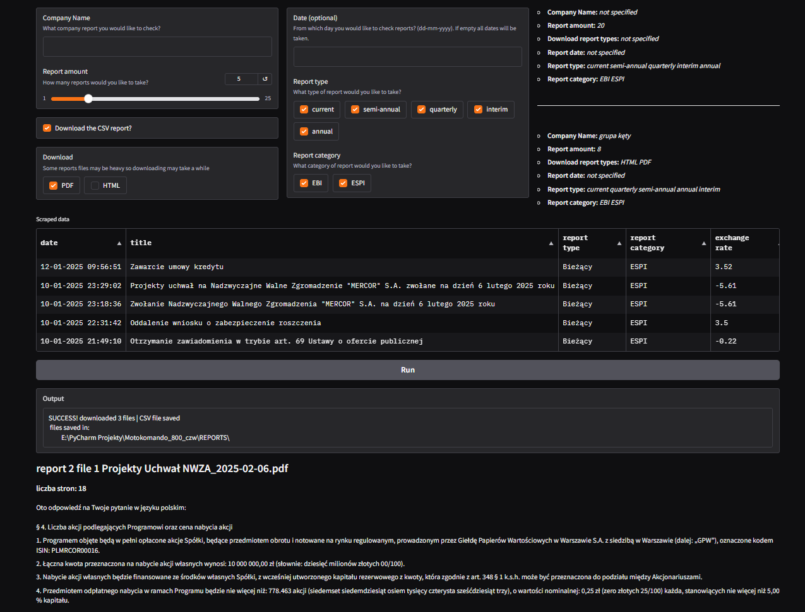
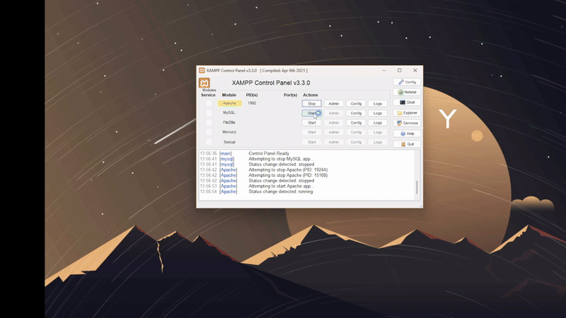
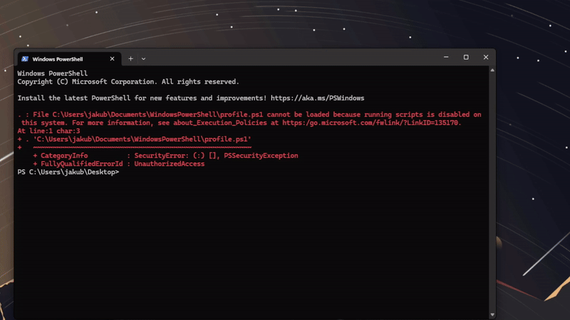
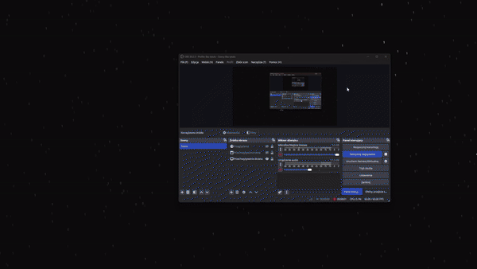
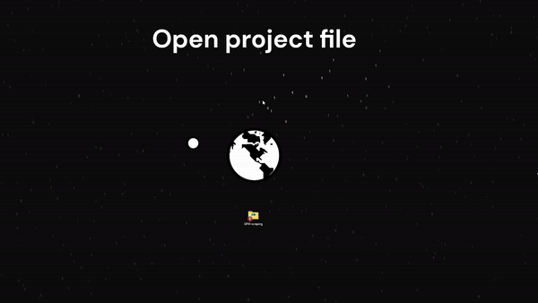

# GPW Scraper - Stock Market Report Automation# GPW Scraping Tool


**Refactored Architecture v2.0** ✨# What is GPW Scraping Tool?


Comprehensive tool for scraping, summarizing, and automating Polish stock exchange (GPW) reports with AI-powered analysis.### GPW (stock exchange) Scraping Tool is a tool that allows you to download reports from the WSE stock exchange. The tool uses a scraping script that automatically downloads reports for selected companies, based on certain parameters.





## 📋 Table of Contents## Functionality


- [Features](#features)#### 1. Downloading reports for selected companies from the Stock Exchange.

- [New Architecture](#new-architecture)

- [Quick Start](#quick-start)#### 2. Filtering of reports based on date, report type and category.

- [Project Structure](#project-structure)

- [Migration Guide](#migration-guide)#### 3. Ability to download attachments in PDF or HTML format.

- [Usage Examples](#usage-examples)

- [Documentation](#documentation)#### 4. Exporting data to CSV file.


## ✨ Features#### 5. Exporting data to MYSQL database.


### Core Capabilities#### 6. Summary downloaded reports

- 🔍 **Smart Web Scraping** - Automated GPW report collection with filtering

- 🤖 **AI Summarization** - K-means clustering + LLM analysis (Ollama)#### 7. Displays history searches

- 📄 **PDF Generation** - Professional reports with WeasyPrint

- 🗄️ **Database Integration** - MySQL/MariaDB with repository pattern## Dictionary

- ⏰ **CRON Automation** - Scheduled tasks with execution tracking

- 📊 **Interactive UI** - Gradio-based dashboard#### `Company name` - Text field where you can post the company name to search.


### Report Filtering#### `Report amount` - How many reports would you like to take.

- **Date ranges** - Flexible date-based queries

- **Report types** - Current, Quarterly, Semi-annual, Interim, Annual#### `Download the CSV report` - If the box is checked then the CSV file is downloading.

- **Categories** - ESPI (main market) / EBI (NewConnect)

- **File formats** - PDF, HTML, CSV export#### `Download` - You can choose witch file type you want download (PDF OR HTML).


### AI Features#### `Date` - From witch day would you like to check reports.

- **Document summarization** - Per-file analysis

- **Collective reports** - Meta-summary across all documents#### `current` - Actual reports.

- **GPU acceleration** - Optimized for CUDA (30x faster than CPU)

- **Model management** - Auto-download, version tracking#### `semi-annual` - Half-year reports.


## 🏗️ New Architecture#### `quarterfly` - Quarterly reports.


### Before Refactoring#### `interim` - Interim reports.

```

├── app.py (1342 lines) ❌#### `annual` - Annual reports.

├── database_connection.py (1012 lines) ❌

├── scrape_script.py (802 lines) ❌#### `EBI` - EBI is a system for information dissemination by NewConnect-listed companies.

└── ... (scattered utilities)

```#### `ESPI` - ESPI is used for mandatory reporting by issuers on the main GPW market.


### After Refactoring ✅#### `Run` - This button attempts scraping GPW, download CSV report with scraped data and summary the reports.

```

src/## Content

├── core/               # Business logic

│   ├── scraper.py      # Web scraping (300 lines)- [user_interface.py](user_interface.py): Gradio-based graphical user interface for convenient parameter entry and display of results.

│   ├── summarizer.py   # AI analysis (350 lines)- [scrape_script.py](scrape_script.py): Script responsible for downloading reports and attachments from the stock exchange.

│   └── pdf_generator.py # Report generation (260 lines)- [summary.py](summary.py): Part responsible for summarise using local model

├── database/           # Data layer- [database_connection.py](database_connection.py): Part responsible for database operations

│   ├── connection.py   # Thread-safe connections- [gpw_data.sql](gpw_data.sql): MySQL database with structure and example data

│   └── repositories/   # 5 specialized repos- [REPORTS](REPORTS): folder that will be created when you run the script. Reports and CSV data are saved to it.

│       ├── company_repo.py

│       ├── report_repo.py## Requirements

│       ├── file_repo.py

│       ├── job_repo.py- at least 10GB free on disk

│       └── history_repo.py- git

├── ui/                 # Interface- Windows only (for now)

│   ├── app.py          # Main assembler- Internet connection

│   ├── shared_utils.py # Common functions- NVIDIA GPU (The better the GPU, the faster the summaries will show up )

│   └── tabs/           # 5 modular tabs- `Python 3.12` (Microsoft store)

│       ├── scraping_tab.py- any database hosting like XAMPP (https://www.apachefriends.org/pl/download.html)

│       ├── automation_tab.py- ollama installed with `llama3.2:latest` model (https://ollama.com/)

│       ├── schedules_tab.py

│       ├── reports_tab.py# Installation

│       └── info_tab.py

├── automation/         # SchedulingOpen CMD in desire directory and clone project using:

│   ├── config.py       # Job configuration

│   ├── scheduler.py    # CRON management### Step 1 (clone repository)

│   └── job_executor.py # Task runner

└── utils/              # Helpers```bash

    └── ollama_utils.py # Model managementhttps://github.com/xHezuSx/pracownia-dyplomowa

```

# Backward compatibility wrappers in root

app.py, scrape_script.py, database_connection.py, etc.

```

### Step 2 (setup database)

### Key Improvements

- ✅ **Modular design** - Single responsibility per module1. run XAMPP with apache and MYSQL

- ✅ **Repository pattern** - Clean database abstraction2. click `Admin` button browser with admin panel will appear

- ✅ **Backward compatibility** - All old imports work3. select `New` and name database `gpw data` and click `Create`. **IMPORTANT it has to be `gpw data` otherwise it won't work**

- ✅ **Zero errors** - Full type safety and validation4. select `Import` section and select `gpw_data.sql` file from cloned repository

- ✅ **Easy testing** - Isolated components5. scroll down and click `Import`

- ✅ **Scalability** - Add features without touching core



## 🚀 Quick Start

### Step 3 (setup ollama)

### Installation

```bash1. Download ollama (https://ollama.com/)

# Clone repository2. Ollama PATH = `C:\Users\<USERNAME>\AppData\Local\Programs\Ollama` <USERNAME> it's your username on Windows

git clone <repo-url>3. open settings search for `environment variables for system`

cd pracownia-dyplomowa4. click `environment variables` select `PATH` and `edit`

5. click `New` and paste your ollama PATH

# Setup virtual environment

python3 -m venv .venv

source .venv/bin/activate

### Step 4 (download model)

# Install dependencies

pip install -r requirements.txt1. Open CMD and run download AI model (2GB)


# Setup database (MySQL/MariaDB)```bash

mysql -u root -p < gpw_data.sqlollama pull llama3.2

```

# Install Ollama (if not installed)

curl -fsSL https://ollama.com/install.sh | sh2. after download use:

```

```bash

### Running the Applicationollama serve

```

**Option 1: Old Entry Point (backward compatible)**

```bash

python app.py

```### Step 5 (install dependencies)


**Option 2: New Entry Point (recommended)**On windows right click on folder where project is, select "open in terminal/CMD" option and run following command:

```bash

python src/main.py```bash

```pip install -r requirements.txt

```

**Option 3: Direct Launch**

```bash

python -c "from src.ui.app import launch; launch()"

```# Information about what has been implemented from the project.


## 📁 Project Structure#### In the project, the main idea was to facilitate the work of business analysts by using the AI model to summarize reports from the GPW. In our project it is possible to choose from which period one wants to get the report, in which format to download them (PDF, HTML), in addition to specify the number of reports one wants to get from the official GPW website.


```# Information on changes in implementation from the design assumptions with an explanation of why.

pracownia-dyplomowa/

├── src/                    # Source code (NEW)#### An additional option that was added during development is the history of recent searches. In doing so, we added a database where search histories are stored.

│   ├── core/              # Business logic

│   ├── database/          # Data access layer# Compliance with the project(including the described deviations).

│   ├── ui/                # User interface

│   ├── automation/        # Scheduling & jobsThe project was created in accordance with the initial design of the project and there were no deviations from previous documentation.

│   ├── utils/             # Utilities

│   └── main.py            # New entry point# Usage

├── docs/                   # Documentation

│   ├── DATABASE_DIAGRAM.md### Step 1 (make sure ollama is running)

│   ├── DATABASE_MIGRATION_PLAN.md

│   └── CRON_AUTOMATION.md- open CMD and use comamnd

├── configs/                # Job configurations

├── REPORTS/                # Downloaded reports```bash

├── SUMMARY_REPORTS/        # Generated summariesollama serve

├── logs/                   # Application logs```

├── scheduled_results/      # CRON execution logs

├── tests/                  # Unit tests (future)### Step 2 (make sure XAMPP (or other MySQL engine) is running)

├── requirements.txt        # Python dependencies

├── gpw_data.sql           # Database schemaOn windows right click on folder where project is, select "open in terminal/CMD" option and run following command:

└── *.py                   # Backward compat wrappers

```### Step 3 (Run app)


## 🔄 Migration GuideIf you run app for the first time it will take more time


### For Developers```bash

python .\user_interface.py

**Old imports (still work):**```

```python

# Databaseif everything is good you should see `Running on local URL:  http://127.0.0.1:7860`. Simply open the link and voilà :)

from database_connection import get_all_companies, insert_report



# Scraping

from scrape_script import scrapePssst... don't worry about warnings in CMD


# Config# Database

from config_manager import ConfigManager

Picture of a relational database

# CRON

from cron_manager import CronManager


# Ollama
from ollama_manager import get_available_models
```

**New imports (recommended):**
```python
# Database
from src.database import get_all_companies, insert_report
from src.database.repositories import CompanyRepository

# Scraping
from src.core.scraper import scrape_gpw_reports
from src.core.summarizer import get_summaries
from src.core.pdf_generator import generate_summary_report

# UI
from src.ui.app import create_demo, launch

# Automation
from src.automation import ConfigManager, CronManager
from src.automation.job_executor import run_job

# Utils
from src.utils import get_available_models, is_model_installed
```

### Breaking Changes
**None!** All old code continues to work thanks to backward compatibility wrappers.

## 💡 Usage Examples

### 1. Manual Scraping (CLI)
```python
from scrape_script import scrape

result = scrape(
    company="CDPROJEKT",
    limit=10,
    date="01-01-2024 - 31-12-2024",
    report_type=["current", "quarterly"],
    report_category=["ESPI"],
    download_csv=True,
    download_file_types=["PDF"],
    model_name="llama3.2:latest"
)

status, df, summaries, pdf_path, collective, files = result
print(f"✅ {status}")
print(f"📄 Generated: {pdf_path}")
```

### 2. Database Queries (New Repository Pattern)
```python
from src.database import DatabaseConnection
from src.database.repositories import CompanyRepository

with DatabaseConnection() as conn:
    company_repo = CompanyRepository(conn)
    
    # Get all companies
    companies = company_repo.get_all()
    
    # Search by name
    cdpr = company_repo.get_by_name("cdprojekt")
```

### 3. Scheduled Jobs
```python
from src.automation import ConfigManager, CronManager, ScrapingConfig

# Create job configuration
config = ScrapingConfig(
    job_name="daily_cdpr",
    company="CDPROJEKT",
    cron_schedule="0 9 * * *",  # Daily at 9 AM
    model="llama3.2:latest",
    report_limit=5
)

# Save to database
manager = ConfigManager()
manager.save_config(config)

# Add to CRON
cron = CronManager()
cron.add_job(config)
```

### 4. Model Management
```python
from src.utils import (
    get_available_models,
    is_model_installed,
    pull_model
)

# List models
models = get_available_models()
for name, installed in models:
    print(f"{'✅' if installed else '⬇️ '} {name}")

# Install model
if not is_model_installed("llama3.2:latest"):
    pull_model("llama3.2:latest")
```

## 📚 Documentation

- **[Database Schema](docs/DATABASE_DIAGRAM.md)** - Full ER diagram
- **[Migration Plan](docs/DATABASE_MIGRATION_PLAN.md)** - v1 → v2 upgrade
- **[CRON Automation](docs/CRON_AUTOMATION.md)** - Scheduling guide
- **[Model Info](scripts/README_models.md)** - Ollama model specs

## 🛠️ Development

### Running Tests
```bash
# Database tests
python database_connection.py

# Import tests
python -c "from src.ui.app import create_demo; print('✅')"
python -c "from src.core.scraper import scrape_gpw_reports; print('✅')"

# Integration test
python -c "from src.database import get_all_companies; print(len(get_all_companies()))"
```

### Code Quality
```bash
# Check syntax
python -m py_compile src/**/*.py

# Type hints (future)
mypy src/

# Linting (future)
pylint src/
```

## 🔧 Configuration

### Database Connection
Edit connection details in `database_connection.py` or environment variables:
```python
DB_CONFIG = {
    "host": "localhost",
    "user": "root",
    "password": "your_password",
    "database": "gpw_scraper"
}
```

### Ollama Settings
GPU optimization in `src/core/summarizer.py`:
```python
llm = ChatOllama(
    model=model_name,
    num_gpu=-1,      # Use all GPUs
    num_ctx=4096,    # Context window
    temperature=0    # Deterministic
)
```

## 📊 Performance

### Before Optimization
- **GPU utilization**: 3%
- **Processing time**: 82s for 88-page document

### After Optimization
- **GPU utilization**: 90%+ ✅
- **Processing time**: 18s (4x faster) ✅

**Key changes:**
- Replaced LangChain `load_summarize_chain` with direct `llm.invoke()`
- Increased `num_ctx` from 2048 to 4096
- Set `num_gpu=-1` (all GPUs instead of 1)

## 🤝 Contributing

1. Fork the repository
2. Create feature branch (`git checkout -b feature/amazing`)
3. Commit changes (`git commit -m 'Add amazing feature'`)
4. Push to branch (`git push origin feature/amazing`)
5. Open Pull Request

## 📝 License

MIT License - see LICENSE file

## 👥 Authors

- Original code: GPW Scraper Team
- Refactoring v2.0: Architecture modernization (November 2024)

## 🙏 Acknowledgments

- **Ollama** - Local LLM inference
- **Gradio** - Interactive UI framework
- **WeasyPrint** - PDF generation
- **BeautifulSoup** - Web scraping
- **LangChain** - AI orchestration

---

**Status**: ✅ Production Ready (v2.0 - Refactored Architecture)
